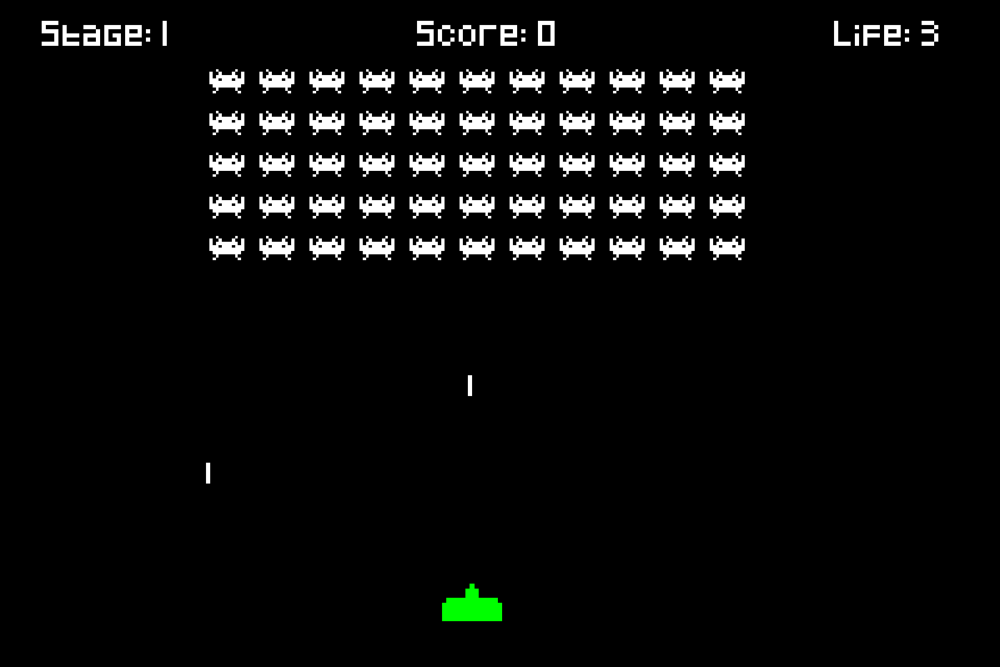
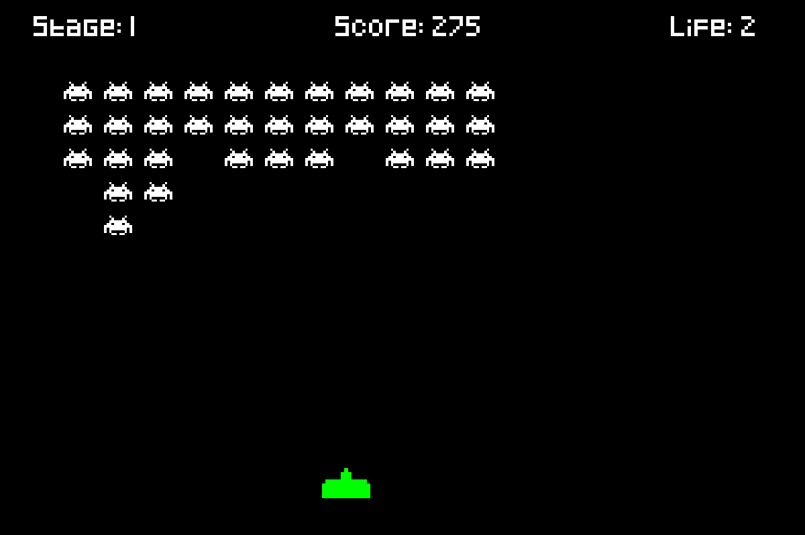

# Space Invaders

This is the first game I've created at ISART Digital Montreal. It was our first game project, after 1 month of learning C.
We weren't in group for this project and we had 1 week.

# Technical informations

- Written in C (C99 standard)
- Cross-platform build system using CMake
- Dependencies: SDL2, SDL2_image, SDL2_ttf

# Building

## Prerequisites

You'll need:
- CMake 3.14 or higher
- A C compiler (GCC, Clang, MSVC, etc.)
- SDL2 development libraries (optional - will be downloaded automatically if not found)

## Linux/macOS

Install SDL2 dependencies (optional but recommended):

**Ubuntu/Debian:**
```bash
sudo apt-get install libsdl2-dev libsdl2-image-dev libsdl2-ttf-dev
```

**macOS (Homebrew):**
```bash
brew install sdl2 sdl2_image sdl2_ttf
```

Then build the project:
```bash
mkdir build
cd build
cmake ..
cmake --build .
./SpaceInvaders
```

## Windows

Install CMake and a C compiler (Visual Studio or MinGW), then:

```bash
mkdir build
cd build
cmake ..
cmake --build .
.\SpaceInvaders.exe
```

Note: If SDL2 libraries are not found on your system, CMake will automatically download and build them from source.


# Screenshots



